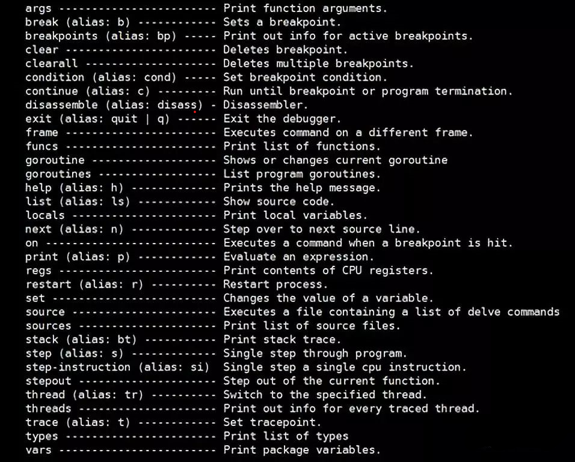
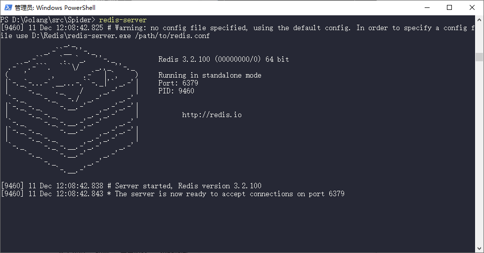

# Spider

### Install package for go

* beego
  
  * `> go get github.com/astaxie/beego`
  
* opentracing-go
  * `> cd  ~\src\github.com\`
  * `> git clone https://github.com/opentracing/opentracing-go.git`
  
* go-sql-driver
  
  * `> go get -u github.com/go-sql-driver/mysql`
  
* goredis
  
  * `> go get github.com/monnand/goredis`
  
* dlv
  * `> cd  ~\src\github.com\`
  * `> git clone https://github.com/go-delve/delve.git`
  * `> cd delve\cmd\dlv`
  * `> go build`
  * `> go install`
  
  
  
  * `> goroutines -s` print all `goroutine`'s stack
  * `> goroutine [n]` change to [n]goroutine
  * `> locals` print all local variables
  
* [goquery](https://blog.csdn.net/yang731227/article/details/89338745)
  
  * `> go get github.com/PuerkitoBio/goquery`
  
* [simplifiedchinese](https://github.com/golang/text)
  * `> cd ~\src\github.com\` 
  * `> git clone https://github.com/golang/text.git`
  
* [go-isatty](https://github.com/mattn/go-isatty)
  * `> cd ~\src\github.com\` 
  * `> git clone https://github.com/mattn/go-isatty.git`
  
* [go-colorable](https://github.com/mattn/go-colorable)
  * `> cd ~\src\github.com\` 
  * `> git clone https://github.com/mattn/go-colorable.git`

### [Install some tools](https://pan.baidu.com/s/1TJew_O9ItKcBCQZj5bLswQ ) 

* Mysql

* Redis

  * download `Redis-x64-3.2.100.msi`

  * config environment

  * some changes in `redis.windows.conf`

    * `requirepass foo bared` --> `requirepass 123456`
    * `maxmemory <bytes>` --> `maxmemory 1024000000`
    * `bind 127.0.0.1`
    * `port 6379`

  * register redis service

    * `> cd ~\Redis\`
    * `> redis-server --service-install redis.windows.conf --loglevel verbose `

  * start server

    * start server: `> redis-server` `> redis-server --service-start`

      

    * connect to client: `> redis-cli` `> redis-cli -h 127.0.0.1 -p 6379 -a 123456`

  * [some command](http://redisdoc.com/)

* Navicat for MySQL

### [WebIM](https://github.com/beego/samples/tree/master/WebIM)

### MySQL: Recovery data from `.idb`

* `> alter table {table name} discard tablespace`
* `> net stop mysql`
* copy the replacement file(.ibd) to overlap current file
* `>alter table {table name} import tablespace`

### Some Urls

* [Display Magnet Table](http://localhost:8080/?type=magnet)
* [Display New Times Images](http://localhost:8080/?type=newtimes)
* [Display Hot Images](http://localhost:8080/?type=fire)
* [Crawl Movie Magnets](http://localhost:8080/?days=10)`# pages of 10 days ago`
* [Crawl Images](http://localhost:8080/?type=newtimes&download=0)`# crawl image without download to local rather store to database directly`
* [Load Images From Database](http://localhost:8080/load?table=newtimes)
* [Store Image Information To Database](http://localhost:8080/load/to/database/?table=newtimes)
* [Clear Redis's Data](http://localhost:8080/clear?op=cs+cus+cv+ms+cms+mv+hv+ntv)`# clear the redis set with specify short keys`

